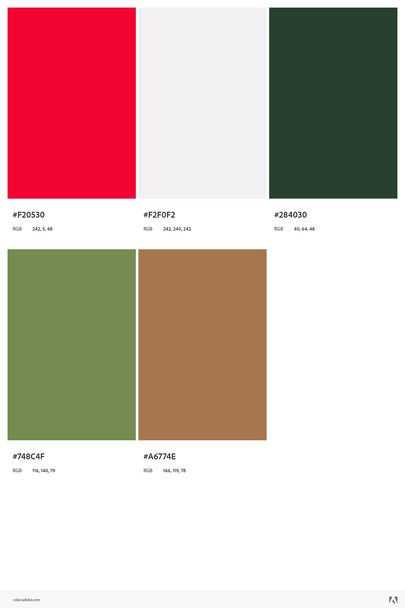

<h2 align="left"></h2>

# The Green Earth Foundation
### Empowering Environmental Action for a Sustainable Future

## Milestone Project 4 - Full Stack Development

<h2 align="left"></h2>

### The Green Earth Foundation is a fictional web application that offers:
- Eco-friendly merchandise: Explore a range of sustainable clothing and accessories that support our environmental initiatives.
- Simple shopping experience: Add products to your bag, update quantities, and proceed to secure checkout with ease.
- Informative environmental news: Read articles and news updates related to environmental issues and stay connected with our initiatives.
- Personalised profile and past orders: Create an account, view order history, and manage details for a personalised experience.

#### This is my Milestone Project 4 submission for Code Institute's Diploma in Web Application Development. The Green Earth Foundation is built using Django full-stack framework and uses a Relational Database. Technologies used include HTML, CSS, JavaScript, Python and Stripe payments.

* Key features include:
- Merchandise Store: Explore and purchase a curated selection of eco-friendly clothing and accessories that contribute to environmental causes.
- Seamless Shopping Experience: Easily add items to your shopping bag, update quantities, and proceed to a secure checkout process.
- Secure Donations: Contribute to the charity's mission through secure one-time donations via purchase of products.
- Personalised Profiles: Create an account to access your profile, view order history, manage delivery addresses, and stay connected with the charity's updates.
- Environmental News Hub: Stay informed with articles and news updates on environmental matters, including updates from the charity's events and initiatives.
- Integrated Payment System: Experience secure and hassle-free payments with integration of Stripe, offering a variety of payment methods and a streamlined checkout process.
- Stripe Checkout: Users can add multiple products to their shopping basket and proceed to checkout with Stripe. See [Stripe's testing card details](https://stripe.com/docs/testing?testing-method=card-numbers#visa) to place an order on the website.

## Live Project

[View the live project here.](https://green-earth-foundation-d0cf978a36b8.herokuapp.com/)

## Repository

[Find the project repository here.](https://github.com/PATIAT/the_green_earth_foundation)

# Table of Contents

## Contents
- [User experience](#user-experience)
  * [User Stories](#user-stories)
- [Design](#design)
  + [Overview](#overview)
  + [Colour Scheme](#colour-scheme)
  + [Typography](#typography)
  + [Imagery](#imagery)
  + [Icons](#icons)
  + [Cards](#cards)
- [Features](#features)
- [Future Features](#future-features)
- [Wireframes](#wireframes)
- [Data Model](#data-model)
- [Technologies used](#technologies-used)
  + [Languages Used](#languages-used)
  + [Frameworks & Libraries](#frameworks--libraries)
  + [Storage & Hosting](#storage--hosting)
  + [Payments](#payments)
  + [IDE & Version Control](#ide--version-control)
  + [Other Tools](#other-tools)
  + [Testing & Code Validation](#testing-code-validation)
- [Testing](#testing)
- [Deployment](#deployment)
- [Credits](#credits)
  + [Code](#code)
  + [Media](#media)
  + [Content](#content)
  + [Acknowledgements](#acknowledgements)

# User Experience

## User stories
| User Story ID | User Role       | User Story                                                                                        | So that I can...                                                                                             |
|---------------|-----------------|--------------------------------------------------------------------------------------------------|----------------------------------------------------------------------------------------------------------------|
 | Viewing and Navigation | 
| 1             | Site user       | I want to be able to visit the website and easily navigate through the main landing page         | Find the information I need and learn about the charity's mission and environmental initiatives              |
| 2             | Site user       | I want the website to be responsive across all devices                                          | Have a seamless browsing experience regardless of the device I'm using                                     |
| 3             | Site User                    | I want to view the available products, such as branded merchandise | ...explore the offerings and choose the products that suit my needs.                                                                           |
 | Registration and User Accounts |
| 4             | Site User                    | I want to be able to register for an account and log in to access personalised features and information.            | ...have a customised experience, save preferences, and access exclusive features.                                                              |
| 5             | Site User                    | I want to be able to reset my password easily in case I forget it.                                                 | ...regain access to my account and protect my data securely.                                                                                    |
| 6             | Site User                    | I want to be able to receive and email confirmation after registering.                                                 | ...verify that my account registration was successful.                                                                                    |
| 7             | Site User                    | I want to have a user profile where I can view my default delivery addresses and see my order history.               | ...access personalized information, manage addresses, and track my previous orders.                                                            |
 | Sorting and Searching | 
| 8             | Customer                    | I want to be able to sort the list of available products              | ...easily identify the best rated, best priced and categorically sorted products.                                                           |
| 9             | Customer                    | I want to be able to sort a specific category of product | ...find the best prices or best rated product in a specific category, or sort the product in that category by name                                                           |
| 10             | Customer                    | I want to be able to search for a product by name or description | ...find a specific product that I’d like to purchase.                                                           |
| 11             | Customer                    | I want to be able to see what I have searched for and the number of results | ...quickly decide on whether the product I want is available.                                                           |
| 12             | Customer        | I want to browse and view the available merchandise in the Products section                    | Explore the products, including clothing and accessories, that contribute to donations                       |
| 13             | Customer        | I want to add products to my shopping bag and have the ability to update or remove items        | Customize my shopping bag and make changes as needed                                                        |
 | Purchasing and Checkout | 
| 14             | Customer        | I want to be able to proceed to checkout securely and make payments using Stripe in test mode  | Complete the purchase of selected items with confidence using a secure payment method in a testing environment |
| 15             | Customer        | I want the option to subscribe to regular donations using Stripe subscription feature           | Contribute to the charity on a recurring basis for ongoing support                                           |
| 16             | Site User                    | I want to have the option to add products to my shopping bag and update or remove items as needed.                   | ...manage my shopping bag contents and make adjustments before proceeding to checkout.                                                          |
| 17            | Customer                     | I want to have a clear overview of the contents of my shopping bag, including the ability to update quantities.     | ...review my selections, make changes, and proceed to checkout with the correct order details.                                                   |
| 18            | Customer                     | I want a secure and user-friendly payment process that accepts various payment methods.                            | ...safely and conveniently complete my purchase using my preferred payment method.                                                              |
| 19            | Customer                     | I want be able to view an order confirmation after checking out                            | ...to verify that I haven’t made any mistakes.                                                              |
| 20            | Customer                     | I want to receive email notifications about my order status, including payment confirmation and shipping updates.   | ...stay informed about the progress of my order and anticipate its delivery.                                                                    |
| Admin and Store Management | 
| 21             | Business Owner  | I want to have control over the content on the Home page                                        | Update the website's main landing page, calls to action, and featured content                                |
| 21            | Business Owner (Superuser)   | I want to be able to create, edit, update, and delete products in the inventory.                                   | ...manage the product offerings, ensure accurate information, and keep the inventory up to date.                                               |
| 22            | Business Owner (Superuser)   | I want to have the ability to publish articles related to environmental issues to educate site users.       | ...share valuable insights and knowledge with the site users to promote awareness and enhance their understanding.                                | 
| 23            | Business Owner (Superuser)   | I want to manage user accounts and have administrative privileges to ensure the smooth operation of the website.   | ...have control over user management and maintain site security.                                               |

## Design

### Overview

- Earthy and Natural: The application's design elements, colour palette, and imagery are inspired by nature, reflecting the earthy tones of greens and browns with striking red for distinctiveness. This creates a sense of harmony with the environment and a connection to the natural world while maintaining that eye-catching draw.

- Clean and Minimalistic: The design follows a clean and minimalistic approach, focusing on simplicity and clarity. It avoids clutter and excessive ornamentation, allowing the content and purpose of the application to shine through.

- Sustainable and Ethical Imagery: The visuals used in the application embrace images that showcase sustainability, eco-friendly practices, and the beauty of nature. This includes photographs of forests, wildlife, renewable energy sources, and people engaging in environmentally conscious activities.

- Intuitive and User-Centric: The user interface prioritises ease of use and intuitive navigation. It employs clear typography, well-organised layouts, and thoughtful placement of interactive elements, ensuring that users can effortlessly explore the application and engage with its features.

- Empowering and Inspiring: The aesthetic of the application aims to evoke a sense of empowerment and inspiration. It incorporates motivational quotes, positive messaging, and uplifting visuals that encourage users to take action towards environmental conservation and make a positive impact on the planet.

Overall, the aesthetic of the application strives to create a visually appealing, engaging, and immersive experience for users, aligning with the mission of the foundation and its commitment to environmental sustainability.

### Colour Scheme

- The Green Earth Foundation uses quite a limited colour palette, making the most of the contrast between white, dark green and a range of lighter greens and brown with a striking red which create a sleek and professional appearance.

- I used the [Adobe Colour Wheel and Accessibility Checker]( https://color.adobe.com/create/color-wheel) to ensure my chosen colour palette had sufficient colour ratio for visually impaired users.

<h2 align="left"></h2>

### Typography

- Headings are in Playfair Display with serif as a fallback font. This font is bold and eye-catching which is intended to attract the attention of the user. The body type is Montserrat with sans-serif as a fallback font. Both typefaces complement each other well and provide an easily legible text that will be easy to read on all device sizes.

### Images

The imagery used in the application aims to inspire, educate, and create an emotional connection with the users, reinforcing the importance of environmental conservation and motivating them to contribute towards a sustainable future. Images include:

- Natural Landscapes: High-quality photographs showcasing breathtaking natural landscapes, such as forests, mountains, oceans, and wildlife habitats. These images evoke a sense of awe and appreciation for the beauty of the Earth.

- Sustainable Practices: Imagery depicting eco-friendly practices like recycling, renewable energy, organic farming, and conservation efforts. These visuals highlight the importance of sustainable living and inspire users to adopt environmentally conscious behaviors.

- Diverse Flora and Fauna: Images featuring a diverse range of plant and animal species, including endangered species and indigenous flora. These visuals celebrate biodiversity and raise awareness about the need to protect and preserve our natural ecosystems.

- Human Connection: Photographs capturing people engaging in environmental activities like tree planting, beach cleanups, and sustainable farming. These images convey the message that individual actions can make a significant impact on the environment and foster a sense of community and collective responsibility.

- Environmental Impact: Visual representations illustrating the consequences of environmental degradation, such as pollution, deforestation, and climate change. These images serve as a reminder of the urgency to address these issues and encourage users to take action.

- Almost all the images are displayed in bootstrap cards with an image cap. This allows the content to be structured and organised in a consistent fashion.

- Consistent aspect ratios have been used to bring visual continuity to the site across different page layouts.

### Icons

- I have used Font Awesome icons throughout the website. They are used within the navigation menus to offer a more clean and sleek appearance. I have used them on buttons to reinforce the action of the button. They are also used within product details pages to visually represent different sections of the product features etc. I have added screen reader alternatives as appropriate.

### Cards

- I decided to use bootstrap cards as a method of containing content in an organised and logical fashion. It also facilitates good user experience by implementing a consistent approach across the website. These include multiple cards with images caps that appear on the products page but also card containers that appear on the shopping basket, checkout and checkout confirmation pages.

# Features

## All Pages

- Responsive design
- Semantic HTML
- Combination of Bootstrap and custom CSS to give the website a consistent and clean aesthetic.

### Header & Navigation

- Website branding name as an H1 Heading
- Navigation with links, including:
  - Donate button
  - Search (search bar functionality)
  - User Profile Options (register/login/view profile/view reviews)
  - Shopping Basket (changes colour if cart is not empty)

### Footer

- About Us
- Social Links 

### Messages

- Success message (including Shopping Basket link when applicable)
- Info message (as necessary)
- Error message (as necessary)
- Warning message (as necessary)

## Homepage

- Main image and CTA
- Featured Merchandise (products)
- Featured News
- Call To Action (CTA) buttons

## All Products Page
- Wide Image
- Sort by:
  - Price (low to high)
  - Price (high to low)
  - Rating (low to high)
  - Rating (high to low)
  - Name (A–Z)
  - Name (Z-A)
  - Category (A-Z)
  - Category (Z-A)
- Count of products on page

## Product Detail Page
  - Featured Image or Fallback Image
  - Product name
  - Product category tag
  - Review (average rating)
  - Product description
  - Quantity
  - Price
  - Back to shop button 
  - Buy now button(adds to shopping basket)

## Shopping Basket Page
- Product details for each product added to bag, featuring:
  - Subtotal
- Remove from shopping basket option
- Shopping Basket Total
- Secure Checkout button
- Back to shopping button

## Checkout Page
- Order summary
- Checkout form, featuring:
  - Option to save information to profile
  - Auto populates with content saved to user profile
  - Stripe payment

## Checkout Confirmation Page/ Email
- Checkout confirmation page
- Sends order confirmation email

## Authentication Pages
- Register/ Log In/ Log Out/ Reset Password Pages
- Features largely provided by Django allauth

## User Profile Page
- Default information form
- Order history
- Users must be logged in
- Users can only access their own User Profile

## Reviews Pages
- Users can view all their reviews
- Users must be logged in
- Users can only access their own reviews

## Add/ Edit/ Delete Products / Articles (superuser)
- Add Product/Article Page
- Edit Product/Article Page
- Delete Product/Article
- Superuser must be logged in
- Superuser only access

# Future Features
- Subscription donations
- Multiple product images

# Wireframes

- [View my wireframes in PDF form here](docs/README/PATIAT_CI_MSP_4_Wireframes.png).

# Data Model

## Database Schema

The following Data models were used:

- Articles - stores information on each of the news articles.
- Basket - stores information on the users shopping basket.
- Products - stores information on each of the products.
- User Profile - stores user information (relates to django allauth user model which is not included here).
- Teams - stores information on each of the team members.

This diagram outlines each model's fields and illustrates the relationship between the models:

<h2 align="left" width="600px"></h2>

# Technologies Used

## Languages Used

- [HTML5](https://en.wikipedia.org/wiki/HTML5)

- [CSS3](https://en.wikipedia.org/wiki/CSS)

- [JavaScript](https://en.wikipedia.org/wiki/JavaScript)

- [Python](https://en.wikipedia.org/wiki/Python_(programming_language))

## Frameworks & Libraries

- [Django](https://www.djangoproject.com/)
  - This website is built using Django, a high-level Python web framework. The Green Earth Foundation contains multiple apps with model, view and template layers. I have also used Django to provide an admin view, create forms and test the website. Further features used include [Django Allauth](https://django-allauth.readthedocs.io/en/latest/index.html) for user authentication, Pillow for uploading images, and Crispy Forms.

- [Jinja](https://jinja.palletsprojects.com/en/3.0.x/)
  - Templating language I've used with Python to add logic to my html templates.

- [jQuery](https://jquery.com/)
  - I used jQuery to add functionality to Bootstrap components and within my scripts.

- [Bootstrap 4](https://getbootstrap.com/) 
  - I used bootstrap throughout the site to make it responsive. The website uses Bootstrap's Containers, Grid System, Flexbox and Spacing utilities. I sourced code from the Bootstrap documentation when building the Navbar, Image Carousels, Cards and Buttons.

- [Google Fonts](https://fonts.google.com/)
  - Fonts are imported from google fonts.
  
- [Font awesome](https://fontawesome.com/)
  - I used icons from font awesome across the website

## Storage & Hosting

- [Heroku](https://id.heroku.com/login)
  - Heroku is the deployment source I used for this project.

- [Github](https://github.com/)
  - Github was used to create and store the project repository.

- [Amazon Web Services](https://aws.amazon.com/)
  - AWS is used to host and store static files and media.

- [ElephantSQL](https://www.elephantsql.com/)
  - ElephantSQL is used to host the website's PostgreSQL database.

## Payments

- [Stripe](https://stripe.com/gb)
  - Stripe is used to handle website payments.

## IDE & Version Control

- [Git](https://git-scm.com/)
  - Git was used as a version control in the terminal.

- [Gitpod](https://gitpod.io/)
  - Gitpod was used to create my files and where I wrote the code.

## Other Tools

- [Balsamiq](https://balsamiq.com/)
  - Balsamiq was used to create Wireframes for the project during the initial planning stage.

- [Techsini](https://techsini.com/multi-mockup/)
  - Techsini was used to help check responsiveness and take screenshots of the page at different screen sizes.

- [Adobe Photoshop](https://www.adobe.com/ie/products/photoshop.html)
  - Photoshop was used to resize images for the website.

- [TinyPNG](https://tinypng.com/)
  - TinyPNG was used to compress images for a faster loading time.

- [WebFormatter](https://webformatter.com/html)
  - WebFormatter was used to help beautify the code.

- [Google Chrome Dev Tools](https://developer.chrome.com/docs/devtools/)
  - Google Chrome's Dev Tools were used while building the project to test responsiveness and for debugging.

- [dbdiagram](https://dbdiagram.io/)
  - Tool used to mock up database structure diagram.

- [Unsplash](https://unsplash.com/)
  - Unsplash was used to source the website imagery.

## Testing & Code Validation

The following tools were used for testing and code validation. You can see results in the Testing section of this README.

- [W3C Markup Validation Service](https://validator.w3.org/)
- [W3C CSS Validation Service](https://jigsaw.w3.org/css-validator/)
- [JSHint](https://jshint.com/)
- [Coverage](https://coverage.readthedocs.io/en/7.0.1/)
- [Lighthouse](https://chrome.google.com/webstore/detail/lighthouse/blipmdconlkpinefehnmjammfjpmpbjk?hl=en)
- [Python Linting on Gitpod](https://open-vsx.org/extension/ms-python/python)
- [WebAIM Contrast Checker](https://webaim.org/resources/contrastchecker/)
- [WAVE Web Accessibility Evaluation Tools](https://wave.webaim.org/)

# Testing

- Please refer [here](docs/TESTING.md) for more information on testing of the Green Earth Foundation website

# Deployment

- Please refer [here](docs/DEPLOYMENT.md) for more information on the deployment of the Green Earth Foundation website

# Credits

- Please refer [here](docs/CREDITS.md) for more information on the credits for the Green Earth Foundation website

## Code

### Code Institute:
  - The groundwork for this website was sourced from the Code Institute’s Boutique Ado walkthrough project which is an e-commerce website. This website has been customised wherever possible. The Basket, Checkout, Stripe payments, webhooks and email verification are comparable to the walkthrough project as I believe the basis of this functionality is sufficient for the user goals of this website. 

### Django:
  - I referred to the Django documentation throughout the development of my project.
    - [Django](https://docs.djangoproject.com/en/4.2/)

### Bootstrap:
  - I have used Bootstrap extensively throughout the development of this website, including for layout utilities and cards. The Bootstrap documentation was referred to when building the navbar, image cards, and dropdowns. These were sourced through the:
    - [Bootstrap documentation](https://getbootstrap.com/docs/4.6/getting-started/introduction/)

### Stack Overflow: 
  - Throughout the development of this website, I have referred to stack overflow article to resolve minor issues.

## Content
- The content for this website has been inspired by other similar websites and organisations, including:
    - [Greenpeace](https://www.greenpeace.org.uk/)
    - [4oceon](https://www.4ocean.com/)
    - [World Land Trust](https://www.worldlandtrust.org/)

## Media

- As I sourced all the images for the Green Earth Foundation website from Pexels and Unsplash, there is an extensive list of media credits available.

- Please refer [here](docs/README/CREDITS.md) for full image and media credits for the Green Earth Foundation website.

## Acknowledgements

- Thank you to my mentor Chris Quinn for helpful feedback, industry insights and recommended tools.

- Thank you to Pasquale Fasulo and Manu Perez at City of Bristol College for their support.

Please note, this website is purely for the sake of a developer's portfolio and not for public use.

Paul Trotter (PATIAT), 2023.