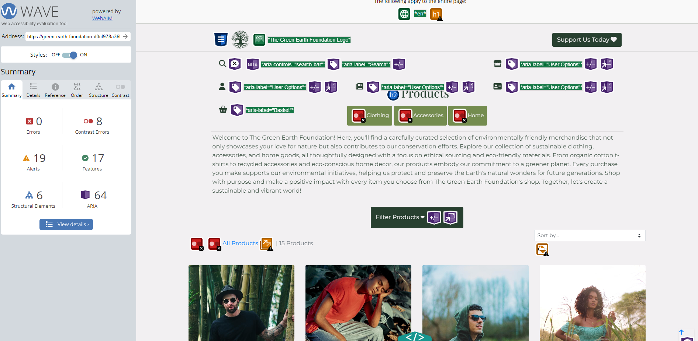
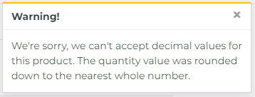

# Testing

The Green Earth Foundation website has been tested using the following methods:

- [Code Validation](#code-validation)
    - [W3C HTML Validator](#w3c-html-validator) 
    - [W3C CSS Validator](#w3c-css-validator)
    - [JSHINT Javascript Code Quality Tool](#jshint-javascript-code-quality-tool)
    - [Python Validation using Gitpod](python-validation-using-gitpod)
- [Accessibility](#accessibility)
    - [Colour Contrast](#colour-contrast)
    - [Wave Webaim Accessibility Checker](#wave-webaim-accessibility-checker)
- [Lighthouse](#lighthouse)
- [Responsiveness](#responsiveness)
- [Browser Compatibility](#browser-compatibility)
- [Testing User Stories](#testing-user-stories)
    - [First Time User](#first-time-user)
    - [Returning User](#returning-user)
    - [Business Owner](#business-owner)
- [Manual Testing](#manual-testing)
- [Automated Testing](#automated-testing)
- [Peer Review](#peer-review)
- [Bugs](#bugs)
    - [Resolved](#resolved)
    - [Unresolved](#unresolved)

# Code Validation

## W3C HTML Validator

The Green Earth Foundation website pages passed all tests using the W3C HTML Validator tool

### Via URL

<h2 align="left" width="600px"></h2>

<h2 align="left" width="600px"></h2>

<h2 align="left" width="600px"></h2>

<h2 align="left" width="600px"></h2>

<h2 align="left" width="600px"></h2>

<h2 align="left" width="600px"></h2>

<h2 align="left" width="600px"></h2>

<h2 align="left" width="600px"></h2>

<h2 align="left" width="600px"></h2>

<h2 align="left" width="600px"></h2>

<h2 align="left" width="600px"></h2>

<h2 align="left" width="600px"></h2>

<h2 align="left" width="600px"></h2>

<h2 align="left" width="600px"></h2>

<h2 align="left" width="600px"></h2>

<h2 align="left" width="600px"></h2>

<h2 align="left" width="600px"></h2>

<h2 align="left" width="600px"></h2>

<h2 align="left" width="600px"></h2>

<h2 align="left" width="600px"></h2>

<h2 align="left" width="600px"></h2>

## W3C CSS Validator

The Green Earth Foundation website passed all tests using the W3C CSS Validator tool.

<h2 align="left" width="600px"></h2>

<h2 align="left" width="600px"></h2>

<h2 align="left" width="600px"></h2>

<h2 align="left" width="600px"></h2>

## JSHINT Javascript Code Quality Tool

The Green Earth Foundation website passed all tests using the JSHint Validator tool.

<h2 align="left" width="600px"></h2>

<h2 align="left" width="600px"></h2>

## Python Validation using Gitpod

* I have checked all Python documents using a PEP8 linter to ensure they are compliant.

* Exceptions include code I have not written in Django settings.

# Accessibility 

## Colour Contrast

* I conducted colour contrast checks to help me decide on an appropriate background colour and text colour. 

<h2 align="left" width="600px"></h2>

## Wave Webaim Accessibility Checker

* I used WAVE Web Accessibility Evaluation Tools to help me check the A11y compliance of my code. Though there could be further improvements, I made a concerted effort to ensure my website is accessible.

<h2 align="left" width="600px"></h2>

<h2 align="left" width="600px"></h2>

<h2 align="left" width="600px"></h2>

# Lighthouse

I used the Lighthouse reports in Google Developer Tools to examine the pages of the website for the following
- Performance
- Accessibility
- Best Practices 
- SEO

There were some less than optimum scores for performance and accessibility which could be resolved by:

- Serve images in next-gen formats
- Eliminate render-blocking resources
- Reduce unused JavaScript
- Form elements do not all have associated labels

## Homepage

### Mobile
<h2 align="left" width="600px"></h2>

### Desktop
<h2 align="left" width="600px"></h2>

## All Products Page

### Mobile
<h2 align="left" width="600px"></h2>

### Desktop
<h2 align="left" width="600px"></h2>

## Product Details Page

### Mobile
<h2 align="left" width="600px"></h2>

### Desktop
<h2 align="left" width="600px"></h2>

## Articles Page

### Mobile
<h2 align="left" width="600px"></h2>

### Desktop
<h2 align="left" width="600px"></h2>

## Team Page

### Mobile
<h2 align="left" width="600px"></h2>

### Desktop
<h2 align="left" width="600px"></h2>

# Browser Compatibility

# Responsiveness

Responsivity tests were carried out using Google Chrome DevTools. Device screen sizes covered include:
- iPhone SE
- iPhone XR
- iPhone 12 Pro
- Pixel 5
- Samsung Galaxy S8+
- Samsung Galaxy S20 Ultra
- iPad Mini
- iPad Air
- Surface Pro 7
- Surface Duo
- Galaxy Fold
- Samsung Galaxy A51/71
- Nest Hub
- Nest Hub Max

I also personally tested the website on iPhone 13 Pro, iPhone SE, iPhone 11, iPad Air, HP 27 All in One.

# Testing User Stories

| User Story ID | User Role       | User Story                                                                                        | So that I can...                                                                                             | Acheived |
|---------------|-----------------|--------------------------------------------------------------------------------------------------|----------------------------------------------------------------------------------------------------------------|------------------------- |
 | Viewing and Navigation | 
| 1             | Site user       | I want to be able to visit the website and easily navigate through the main landing page         | Find the information I need and learn about the charity's mission and environmental initiatives              | Yes |
| 2             | Site user       | I want the website to be responsive across all devices                                          | Have a seamless browsing experience regardless of the device I'm using                                     | Yes |
| 3             | Site User                    | I want to view the available products, such as branded merchandise | ...explore the offerings and choose the products that suit my needs.                                                                           | Yes |
 | Registration and User Accounts |
| 4             | Site User                    | I want to be able to register for an account and log in to access personalised features and information.            | ...have a customised experience, save preferences, and access exclusive features.                                                              | Yes |
| 5             | Site User                    | I want to be able to reset my password easily in case I forget it.                                                 | ...regain access to my account and protect my data securely.                                                                                    | Yes |
| 6             | Site User                    | I want to be able to receive and email confirmation after registering.                                                 | ...verify that my account registration was successful.                                                                                    | Yes |
| 7             | Site User                    | I want to have a user profile where I can view my default delivery addresses and see my order history.               | ...access personalized information, manage addresses, and track my previous orders.                                                            | Yes |
 | Sorting and Searching | 
| 8             | Customer                    | I want to be able to sort the list of available products              | ...easily identify the best rated, best priced and categorically sorted products.                                                           | Yes |
| 9             | Customer                    | I want to be able to sort a specific category of product | ...find the best prices or best rated product in a specific category, or sort the product in that category by name                                                           | Yes |
| 10             | Customer                    | I want to be able to search for a product by name or description | ...find a specific product that I’d like to purchase.                                                           | Yes |
| 11             | Customer                    | I want to be able to see what I have searched for and the number of results | ...quickly decide on whether the product I want is available.                                                           | Yes |
| 12             | Customer        | I want to browse and view the available merchandise in the Products section                    | Explore the products, including clothing and accessories, that contribute to donations                       | Yes |
| 13             | Customer        | I want to add products to my shopping bag and have the ability to update or remove items        | Customise my shopping bag and make changes as needed                                                        | Yes |
 | Purchasing and Checkout | 
| 14             | Customer        | I want to be able to proceed to checkout securely and make payments using Stripe in test mode  | Complete the purchase of selected items with confidence using a secure payment method in a testing environment | Yes |
| 15             | Customer        | I want the option to subscribe to regular donations using Stripe subscription feature           | Contribute to the charity on a recurring basis for ongoing support                                           | No - added to potential future features |
| 16             | Site User                    | I want to have the option to add products to my shopping bag and update or remove items as needed.                   | ...manage my shopping bag contents and make adjustments before proceeding to checkout.                                                          | Yes |
| 17            | Customer                     | I want to have a clear overview of the contents of my shopping bag, including the ability to update quantities.     | ...review my selections, make changes, and proceed to checkout with the correct order details.                                                   | Yes |
| 18            | Customer                     | I want a secure and user-friendly payment process that accepts various payment methods.                            | ...safely and conveniently complete my purchase using my preferred payment method.                                                              | Yes |
| 19            | Customer                     | I want be able to view an order confirmation after checking out                            | ...to verify that I haven’t made any mistakes.                                                              | Yes |
| 20            | Customer                     | I want to receive email notifications about my order status, including payment confirmation and shipping updates.   | ...stay informed about the progress of my order and anticipate its delivery.                                                                    | Yes |
| Admin and Store Management | 
| 21             | Business Owner  | I want to have control over the content on the Home page                                        | Update the website's main landing page, calls to action, and featured content                                | Yes |
| 21            | Business Owner (Superuser)   | I want to be able to create, edit, update, and delete products in the inventory.                                   | ...manage the product offerings, ensure accurate information, and keep the inventory up to date.                                               | Yes |
| 22            | Business Owner (Superuser)   | I want to have the ability to publish articles related to environmental issues to educate site users.       | ...share valuable insights and knowledge with the site users to promote awareness and enhance their understanding.                                | Yes |
| 23            | Business Owner (Superuser)   | I want to manage user accounts and have administrative privileges to ensure the smooth operation of the website.   | ...have control over user management and maintain site security.                                               | Yes |

# Automated Testing

* I have developed a comprehensive set of automated tests using the Python unittest framework in Django. These tests encompass various aspects such as views, forms, and models, wherever applicable. You can locate the tests in the tests.py files within the respective apps.

* Although there are certain sections of my project that lack automated test coverage due to time limitations, I believe the existing testing, combined with manual testing, is sufficient.

## All tests passing

* In total I written 21 tests which all passed as can be demonstrated below:

<h2 align="left" width="600px"></h2>

## Coverage

* I have used coverage to calculate the percentage of my code which is covered by unittests. The result is 63%.

* You can see a breakdown by app in [PDF form here](TESTING/testing_coverage_html_summary.pdf).

<h2 align="left" width="600px"></h2>

# Manual Testing

## Navigation

- The main navigation buttons have been tested and work.
- User permissions have been tested and work.

<h2 align="left" width="600px"></h2>

<h2 align="left" width="600px"></h2>

<h2 align="left" width="600px"></h2>

## Footer

- Social links in the footer have been tested and work.

<h2 align="left" width="600px"></h2>

## Homepage

- Buttons have been tested and work.
- Links have been tested and work.

<h2 align="left" width="600px"></h2>

<h2 align="left" width="600px"></h2>

## All Products and Filters

- Filters have been tested and work.
- Buttons have been tested and work.
- Links have been tested and work.

<h2 align="left" width="600px"></h2>

<h2 align="left" width="600px"></h2>

<h2 align="left" width="600px"></h2>

## Search

- Search criteria works as expected.
- No search criteria works as expected.

<h2 align="left" width="600px"></h2>

<h2 align="left" width="600px"></h2>

## Product Detail Page

- All product related content renders as expected.
- Increment and Decrement values work as expected.

<h2 align="left" width="600px"></h2>

<h2 align="left" width="600px"></h2>

## Basket

- Basket renders when one or more products are added.
- Buttons have been tested and work.
- Message appears when no items are in basket.
- Products can be added to or removed from basket.

<h2 align="left" width="600px"></h2>

<h2 align="left" width="600px"></h2>

<h2 align="left" width="600px"></h2>

## Checkout

- Basket renders as expected.
- Signed in users can save information to profile.
- Invalid card details error messages appear.

<h2 align="left" width="600px"></h2>

<h2 align="left" width="600px"></h2>

<h2 align="left" width="600px"></h2>

## Order Success

- Order success page renders as expected.

<h2 align="left" width="600px"></h2>

## User authentication

- Register, sign in and sign out pages render as expected.
- Non-authenticated users cannot access user profile, they are redirected to sign in screen.

<h2 align="left" width="600px"></h2>

<h2 align="left" width="600px"></h2>

<h2 align="left" width="600px"></h2>

## User Profile

- User profile renders as expected.
- Links have been tested and work.
- Users can update their information from the form.

<h2 align="left" width="600px"></h2>

### Confirmation Email

- Email confirmations are sent and received as expected.

<h2 align="left" width="600px"></h2>

<h2 align="left" width="600px"></h2>

# Peer Review

- It was my intention as with my other projects to submit them on the Code Institute slack channel for peer review. However, as time was constrained, I knew I would not have time to include any of that feedback on my testing documentation. I submitted the project for peer review anyway.

# Bugs

## Resolved

### Value error when adding a float value to the basket and attempting to update the basket.

* Existing code was `quantity = int(request.POST.get('quantity'))`

<h2 align="left" width="600px"></h2>

* Fix: The error occurs because the value retrieved from the request.POST dictionary is a float, which cannot be converted to an integer using the int() function. The int() function can only convert strings that represent integers. As I needed and Integer value, I decided to round the floating-point number to the nearest integer using the round() function and this worked.

`quantity = int(round(float(request.POST.get('quantity'))))`

This worked but there was no information being passed to the user to tell them this information or what had happened. Therefore, having researched the Django documentation, I decided to create a new variable 
‘float_quantity’ as follows and amend the ‘quantity’ variable to:

`float_quantity = float(request.POST.get('quantity'))`
`quantity = int(float_quantity)`

Then, to check if the float value was rounded down, the following if statement was implemented with a message to the user to inform them of what happened. 

```
if float_quantity != quantity:
        messages.warning(request, "We're sorry, we can't accept decimal values for this product. The quantity value was rounded down to the nearest whole number.")
```

Upon testing, this appeared to work:

<h2 align="left" width="600px"></h2>

## Unresolved

### When the postcode in the address given at checkout and in the stripe payment field do not match, the webhook appears to beleive that the order hasn't been created and it creates a duplicate. 

* I discovered this at a late stage in development and have not had sufficient time to resolve it, although it would be a priority time allowing.

Back to [README.md](/README.md#testing)